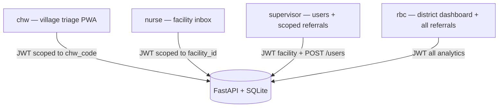
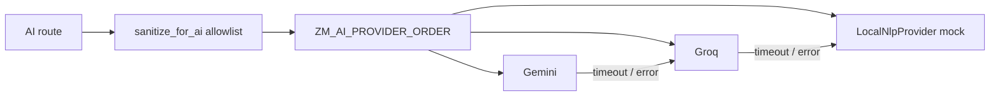
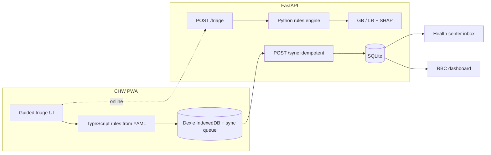
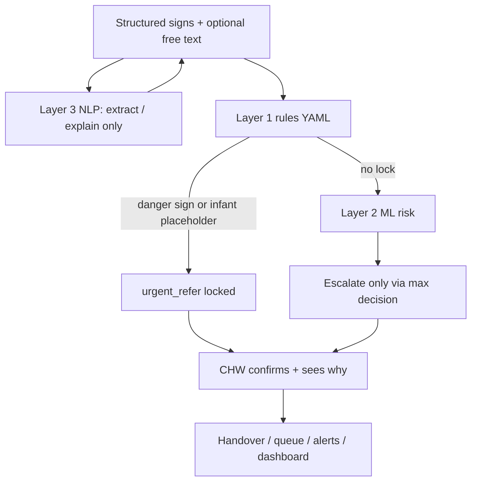

# Architecture — ZeroMalaria

**Synthetic demo data.** Decision support tool. Not a replacement for clinical judgment.

## Roles and access



| Role | Primary UI | API scope |
| --- | --- | --- |
| `chw` | Desktop `/app/chw` + `/app/triage` (StepperLayout); phone `/m/*` | Own referrals; sync queue |
| `nurse` | `/app/referrals` TwoPanel inbox | Facility referrals; status PATCH |
| `supervisor` | `/app/dashboard` scoped + Users | Facility referrals; create CHW users |
| `rbc` | `/app/dashboard` analytics + hotspots | Analytics, hotspots, all referrals |

Demo logins: `chw.demo`, `nurse.demo`, `supervisor.demo`, `rbc.demo` (password `demo1234`).

## Offline vs online tiers

```mermaid
flowchart LR
  subgraph tier1 [Tier 1 — always local]
    RulesTS[YAML rules in TS]
    IDB[(IndexedDB)]
    Queue[Sync queue]
  end

  subgraph tier2 [Tier 2 — online optional]
    TriageAPI[POST /triage]
    NLP[/nlp / ai routes]
    Voice[/voice/speak]
  end

  subgraph tier3 [Tier 3 — online required]
    Inbox[Facility inbox poll]
    Dash[RBC KPIs + hotspots]
    Auth[JWT login]
  end

  RulesTS --> IDB --> Queue
  Queue -->|POST /sync| DB[(SQLite)]
  tier2 --> DB
  tier3 --> DB
```

- **Tier 1:** CHW can complete triage and urgent referral with no network; decisions use the same rules file as the server.
- **Tier 2:** When online, server triage/AI can enrich; failures fall back to local rules + mock NLP.
- **Tier 3:** Nurse/RBC operational views poll the API; RBC hotspots are skipped when offline (empty signals, no error banner).

## AI provider fallback



Env: `ZM_GEMINI_API_KEY`, `ZM_GROQ_API_KEY`, `ZM_AI_PROVIDER_ORDER`, `ZM_AI_TIMEOUT_SECONDS`. No keys → Local only.

## System context



## Decision layers



## Single source of clinical truth
- `rules/malaria_rules.yaml` → `apps/api/engine/rules.py`
- Same YAML → `apps/web/scripts/generate_rules_ts.py` → `src/rules/malariaRules.generated.ts` → offline `evaluateRules`

## Offline sync
1. CHW completes triage with local rules.
2. Referral stored in IndexedDB and sync queue with client UUID.
3. On connectivity, `POST /sync` upserts by `client_uuid` (idempotent).
4. Facility and CHW UIs poll for status changes.

## Safety invariant
`final_decision = max_rank(rules_decision, ml_proposed_decision)`  
Unit tests in `apps/api/tests/test_decision.py` and `apps/web/src/rules/engine.test.ts` enforce that urgent referral cannot be downgraded.
