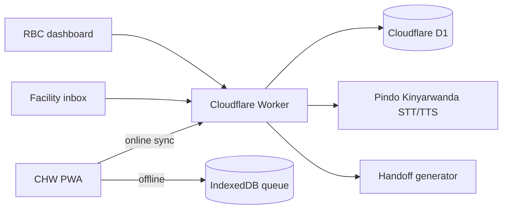
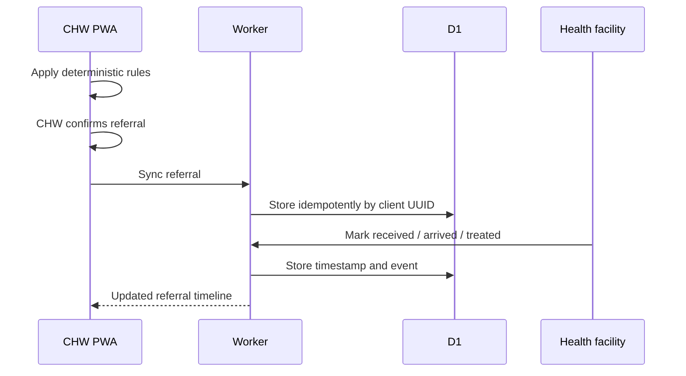

# Architecture

## Safety boundary

- The PWA evaluates deterministic RBC rules locally.
- The Worker never asks Pindo or an AI model to choose clinical urgency.
- Voice transcripts fill a field only after CHW confirmation.
- The generated handoff contains supplied facts and the locked rules decision.
- Missing cloud services do not prevent touch triage or offline referral queueing.

## Runtime components

- `apps/web`: React, Vite, TypeScript, IndexedDB and service worker.
- `apps/worker`: TypeScript Worker, authentication, Pindo proxy and API routes.
- `apps/worker/migrations`: D1 database schema.
- `apps/worker/seed.sql`: synthetic development accounts and operational samples.
- `apps/web/src/rules`: deterministic client-side clinical engine.

## Referral sequence

